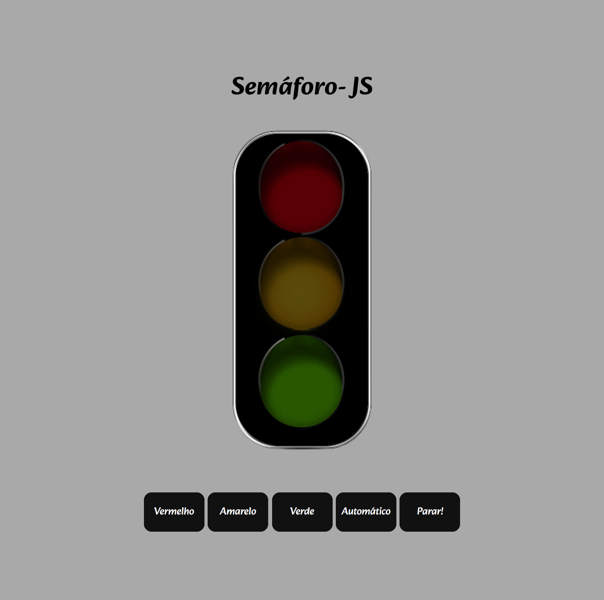

# Semáforo

Neste projeto criei um semáforo com ações, para ligar camada uma das cores e a opção automático.

 
   <ul>
   <h2>Para isso utilizei:<h2>
<li>Recursos do javascript como ternário.</li>
<li>Funções do tipo arrow.</li>
<li>Funções armazenadas em objetos para criar a chamada dinâmica e temporizadores.</li>
</ul>
 

